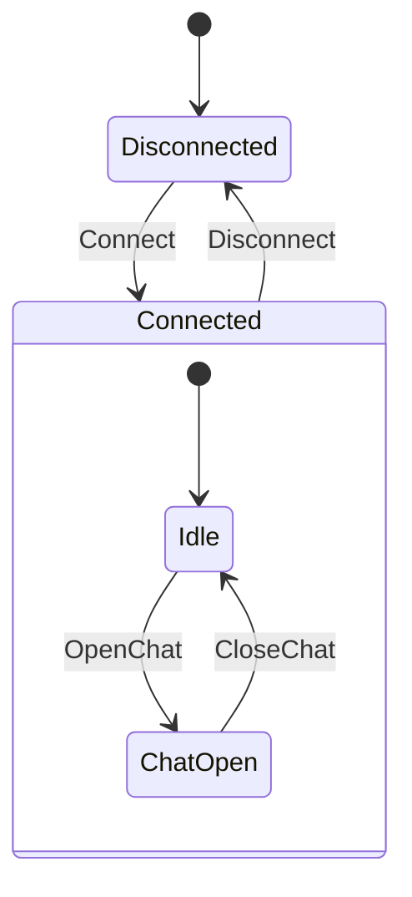

# Koma: MVI, statecharts and Time Travel for Kotlin Multiplatform

Koma helps you describe **what a feature can do in each state**. The UI sends actions; the
Store processes them and exposes immutable state. Use a small Store for a counter, explicit
states for loading/retry flows, or a statechart when a feature has nested or parallel phases.

This is [roman-n1/koma](https://github.com/roman-n1/koma), a fork of
[koma-kt/koma](https://github.com/koma-kt/koma), based on upstream **4.0.0**. It adds an optional
declarative statechart model, pure decision machines, structured recording and Time Travel.
The original Store DSL remains available.

## Start here

| You want to… | Start with… |
|---|---|
| Understand actions, state and a Store | [The counter below](#1-a-store-for-a-counter), then [koma-core](koma-core/README.md) |
| Model Loading → Content or Error | [koma-core](koma-core/README.md#states-for-a-loading-screen) |
| Describe nested/parallel phases and draw their transitions | [koma-statechart](koma-statechart/README.md) |
| Keep I/O separate from decisions and replay them | [A pure Machine below](#3-a-machine-makes-decisions-io-runs-afterward) |
| Connect a Store to Compose | [koma-compose](koma-compose/README.md) |
| Reproduce a bug from a saved run | [The runnable Time Travel example](examples/time-travel/README.md) |
| Look up the full original Store DSL | [Store API guide](doc/guides/store-api.md) |

## 1. A Store for a counter

Three concepts are enough to start:

- **State** is the data you can render now: the count is 0.
- **Action** is an input: the user pressed Increment.
- **Store** processes actions and publishes the resulting state: the count becomes 1.

```kotlin
import koma.core.Action
import koma.core.State
import koma.core.Store
import kotlinx.coroutines.CoroutineScope

data class CounterState(val count: Int = 0) : State

sealed interface CounterAction : Action {
    data object Increment : CounterAction
    data object Decrement : CounterAction
}

fun counterStore(scope: CoroutineScope): Store<CounterState, CounterAction, Nothing> =
    Store(CounterState(), context = scope.coroutineContext) {
        state<CounterState> {
            action<CounterAction.Increment> {
                nextState { state.copy(count = state.count + 1) }
            }
            action<CounterAction.Decrement> {
                nextState { state.copy(count = (state.count - 1).coerceAtLeast(0)) }
            }
        }
    }
```

The owner supplies a lifecycle scope, creates the Store once, collects `store.state` and calls
`store.dispatch(CounterAction.Increment)` on a click. Dispatch queues work; collect the
`StateFlow` rather than assuming that `currentState` has already changed when dispatch returns.
Call `store.close()` when the owner is destroyed. `Nothing` means this Store emits no events.

Events, such as navigation requests, are separate from persistent state. The ordinary Store
event flow is transient; retained effects are available on the Machine path described below.

## 2. Which kind of state machine do you need?

A **state machine** says which transitions are allowed. A **statechart** extends that idea
with hierarchy, parallel regions and history. Choose the smallest model that explains your
feature's behaviour.

| Shape | Example | Koma representation |
|---|---|---|
| One state with changing data | A counter or an editable form | A data class implementing `State` |
| Flat, mutually exclusive phases | Idle → Loading → Content or Error | Sealed `State` variants, or `AtomicState` chart nodes |
| Hierarchical phases | Connected contains Idle and ChatOpen | `CompoundState`; one active child at a time |
| Parallel phases | Connection status and upload status evolve independently | `ParallelState`; every region is active |
| Return to a previous substate | Resume an interrupted multi-step editor | `HistoryState`: shallow remembers the direct child, deep remembers its nested configuration |
| Timed transitions | Debounce a query or leave Loading after a timeout | `Trigger.After`; command execution belongs to the runtime |

For example, ChatOpen and Idle share the Connected lifetime:



Moving Idle → ChatOpen keeps Connected active. Disconnect exits the active child and then
Connected. In parallel regions, Connection.Online and Upload.Sending can both be active; they
are not competing choices in one sealed state.

**Keep data as data.** A query string, selected contacts, a counter and scroll position belong
in state/context fields. Loading, Editing and WaitingForConfirmation are useful nodes because
they change which actions, commands or lifetimes are allowed. You do not need a node for every
possible query or count.

In a chart, `StateId` identifies a node; `StateConfiguration` says which nodes are active;
**context** holds the feature's data. A node such as Loading is not a Kotlin `State` object.
The Store adapter combines configuration and context into the state exposed to the UI.

## 3. A Machine makes decisions; I/O runs afterward

There are two ways to execute a chart:

| Runtime | Use it when… | State exposed by the Store |
|---|---|---|
| `StateChartStore` | You want chart lifetimes with coroutine activities and hooks | `ChartState<C>` |
| `Machine` + `MachineStore` | You want pure decisions, explicit commands and replay | `MachineSnapshot<C>` |

A pure `Machine` takes a snapshot and an input and returns a `Decision`. Commands, timer
changes and effects are data in that decision. `MachineStore` commits it, then a
`CommandHandler` performs I/O and sends results back as new inputs.

Here is a replay-ready counter, reusing `CounterAction` from the first example:

```kotlin
import koma.statechart.*
import koma.statechart.machine.*

data class CounterContext(val count: Int = 0)

val counting = StateId("Counting")
val counterChart = StateChartDefinition(
    initial = counting,
    states = listOf(AtomicState(counting)),
    transitions = listOf(
        Transition(counting, counting, ActionMatcher.of<CounterAction.Increment>("Increment"), effect = "increment"),
        Transition(counting, counting, ActionMatcher.of<CounterAction.Decrement>("Decrement"), effect = "decrement"),
    ),
)

val counterMachine = Machine<CounterContext, CounterAction, Nothing, Nothing>(
    DefinitionId("counter"), DefinitionVersion("1"), counterChart,
) {
    effect("increment") { context, _ -> context.copy(count = context.count + 1) }
    effect("decrement") { context, _ -> context.copy(count = (context.count - 1).coerceAtLeast(0)) }
}

val started = counterMachine.decide(
    counterMachine.initialSnapshot(CounterContext()), MachineInput.Start(MachineTime.Zero),
)
val incremented = counterMachine.decide(
    started.snapshot, MachineInput.Dispatch(CounterAction.Increment, MachineTime.Zero),
)
// incremented.snapshot.context.count == 1; no Store or coroutine was started.
```

An external self-transition exits and re-enters its node. For context-only changes without
that lifetime change, a Machine can use `onAction`; see the
[machine guide](koma-statechart/README.md#replay-ready-machine).

The same approach works for a loader: entering Loading registers `FetchItems`, the handler
calls a repository, and `ItemsLoaded` moves the machine to Content. Replay re-decides those
recorded inputs and checks the resulting snapshots, commands and effects; it does not call
the repository. Guards and effects are labelled in the model, with their implementations
supplied to the runtime. See [the complete statechart guide](koma-statechart/README.md).

## 4. Time Travel from a real saved run

The [desktop example](examples/time-travel/README.md) has a cart and an order summary. A bug
forgets discount 20 on price 100, so both machines show 100 instead of 80.

```sh
./gradlew :time-travel-example:run
# The same full workflow without opening a window:
./gradlew :time-travel-example:run --args='--check'
```

Record checkout → reopen the saved files → compare the corrected reducer → see the first
divergence → branch from its checkpoint → script a price response → return to the original
replay. Group navigation restores every member at one position. Experiments use a virtual
clock and application-supplied inputs/routes; they leave the recording and live runtime alone.

An arbitrary coroutine Store can be inspected, but deterministic replay needs the pure
Machine path and compatible definitions/codecs. Debug tooling belongs in debug dependencies;
the CI checks that production modules do not depend on it.

## Modules

Every library module has its own README with setup, examples and its contract.

| Module | Purpose |
|---|---|
| [koma-core](koma-core/README.md) | Store DSL, immutable state, actions/events, coroutine lifetimes and persistence |
| [koma-compose](koma-compose/README.md) | `ViewStore`, state rendering, derived UI values and transient event collection |
| [koma-message](koma-message/README.md) | Process-wide message plugin for ordinary Stores |
| [koma-logging](koma-logging/README.md) | Store logging and structured journal output |
| [koma-test](koma-test/README.md) | Await processing, record states/events and diagnose handlers |
| [koma-statechart](koma-statechart/README.md) | Declarative model, validation, diagrams, chart runtime and pure Machines |
| [koma-statechart-compose](koma-statechart-compose/README.md) | Retained Machine effects delivered to Compose |
| [koma-statechart-test](koma-statechart-test/README.md) | Scripted commands, virtual time and Machine test driver |
| [koma-observability](koma-observability/README.md) | Ordered, bounded diagnostic journal and file storage |
| [koma-timetravel](koma-timetravel/README.md) | Recording, codecs, checkpoints, replay and isolated branches |
| [koma-timetravel-compose](koma-timetravel-compose/README.md) | Inspector UI and group replay/experiment controls |
| [time-travel-example](examples/time-travel/README.md) | Runnable JVM debug application; not a published library |

## Installation

The fork's configured coordinates are **`io.github.roman-n1:<module>:5.0.0-alpha.1`**.
No fork release is published yet; use a local checkout/composite build today:

```kotlin
// settings.gradle.kts in your application
includeBuild("../koma") // path to this repository; its root name is Koma
```

```kotlin
// Kotlin Multiplatform build.gradle.kts in your application
kotlin {
    sourceSets {
        commonMain.dependencies {
            implementation("io.github.roman-n1:koma-core:5.0.0-alpha.1")
            // Optional: implementation("io.github.roman-n1:koma-statechart:5.0.0-alpha.1")
        }
    }
}
```

The publishing convention sets the included projects' group/version, so Gradle substitutes
the matching coordinates. Add only the modules you need. External sources and debug
tools currently need `@OptIn(koma.core.ExperimentalKomaApi::class)` at their use sites.
Keep all Koma modules on the same fork version; the original `io.github.koma-kt` classes and
the fork's classes have the same packages and must not be mixed in one dependency graph.
For an Android-only build, the same dependency line belongs in `dependencies { … }`.

## What differs from the original project?

The comparison is with the recorded **upstream base 4.0.0**, not a claim about future upstream
releases. The original Store DSL, Compose helpers, messaging, logging and test support remain.

| Area | Upstream base 4.0.0 | This fork adds |
|---|---|---|
| State management | State-specific Kotlin Store handlers | Optional statechart nodes/transitions as inspectable data |
| State structure | Ordinary Store states | Hierarchy, parallel regions, history and chart timers |
| I/O and decisions | Coroutine work in Store handlers | Pure Machine decisions and explicit command/executor checkpoints |
| Diagnostics | Plugin observation and logging | Ordered structured journal, bounded retention and file readers |
| Debugging | Inspect/test Store behaviour | Single/group replay, divergence details and isolated experiments |
| UI/test integration | Core Compose and test helpers | Retained effect mailbox, virtual Machine test driver and inspector |
| Runtime/build assurance | Original runtime and build | Documented race/error fixes, API dumps, debug dependency checks and six CI targets |

The pure chart/Machine data model, journal and recording formats have a stable API/format
policy. Evolving Store-adapter configuration, external-source integration, replay and inspector
APIs retain experimental markers; see the [stability boundary](doc/internal/adr/2026-10-01-stable-core.md).
The supported statechart subset does not yet include eventless/completion transitions, final
states, internal transitions or SCXML `invoke`. Device measurements and messenger integration
remain separate work. The [divergence inventory](doc/internal/design/2026-09-28-statechart-roadmap.md#divergence-inventory-vs-upstream-400)
records the individual changes and their route back upstream.

## Contributing and deeper reading

- [Store API guide](doc/guides/store-api.md): recovery, launch/transaction, persistence, policies and full plugin examples.
- [Internal documentation](doc/internal/README.md): architecture, decisions, review evidence and roadmap.
- [Build conventions](build-logic/README.md): coordinates, publishing and project setup.
- Validation: `./gradlew jvmTest apiCheck checkDebugGraph`; the CI also tests Android, iOS, JS and Wasm.
- Published artifacts: `scripts/verify-published-consumer.sh jvm` builds an
  [independent Maven consumer](verification/published-consumer/README.md); CI also compiles its
  Android, JS, Wasm and iOS variants.

Previously compiled stable consumers are checked separately by the
[binary upgrade fixture](verification/binary-consumer/README.md) on JVM, JS, Wasm and iOS.
