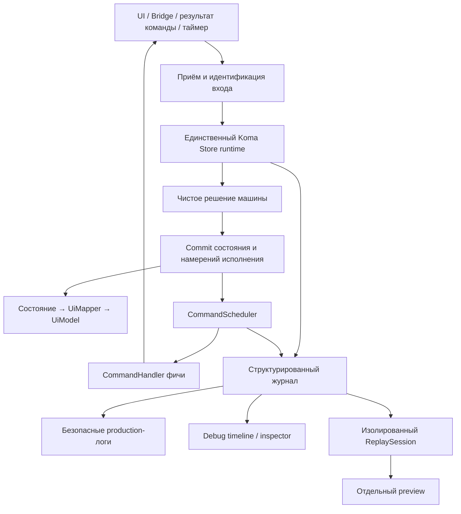

# Handoff: MVI + Statechart + Time Travel + логирование

- Updated: 2026-09-29.
- Репозиторий: `roman-n1/koma`.
- Проверенная база: `df7fd9354015695dfcd5862362ddfa6a00d0f5b3`, после PR #25.
- Статус: проект будущей архитектуры. Новые API, модули и гарантии ниже ещё не реализованы,
  кроме отмеченных в §13.1.
- На базе прошли 558 JVM-тестов и CI: JVM, Android host, iOS Simulator Arm64, JS/browser, Wasm/browser.

## 1. Задача и границы

Построить на форке Koma основу для мессенджера: декларативная машина управляет сценарием,
состояние преобразуется в `UiModel`, компонент связывает Store с Decompose, Bridge и UI.
В нескольких вкладках могут одновременно жить отдельные экземпляры одного компонента,
включая два экземпляра для одного чата.

Следующая цель — структурированная диагностика и Time Travel:

1. Просмотреть историю, причины переходов, активные узлы, команды и ошибки.
2. Воспроизвести записанный сценарий с шагами назад/вперёд.
3. Создать из исторического состояния изолированную ветку и подать новое событие.
4. Воспроизводить взаимодействие группы машин, например root + Main + Bridge + пагинация.

Сначала поставляется журнал и инспектор. Полный replay появляется отдельным этапом,
но его контракты закладываются до массового переноса фич.

Этот документ адаптирует прежний план «FlowMVI + собственная машина» к Koma:
**в целевом варианте Koma — единственный Store runtime компонента**. Второй Store FlowMVI
или MVIKotlin поверх него не создаётся. Чистые переходы, команды как данные, `UiMapper`,
Bridge и раздельное тестирование сохраняются. Устаревшие skills, требующие MVIKotlin,
не должны автоматически возвращать предыдущий стек.

Decompose, domain/repository, Room, транспорт сообщений, Paging3 и оконная пагинация сохраняют
свои обязанности. Долговечный outbox доставки сообщений — ответственность приложения.
Диагностический журнал не заменяет outbox и не обеспечивает exactly-once выполнение сети.

## 2. Что уже есть и чего недостаточно

| Существующая часть | Возможность | Граница для Time Travel |
|---|---|---|
| `StateChartDefinition` | Модель узлов, переходов, guards/effect labels, history и таймеров | Нужны явные версии definition и стабильные идентификаторы переходов/таймеров |
| `StateChartRuntime.step/fire` | Чистый расчёт конфигурации, выбранных переходов, входов/выходов и таймеров | Не возвращает полностью вычисленное бизнес-состояние вместе с типизированными командами |
| `StateChartStore` | Context, hooks, activities, корутины и интеграция с Store | Hooks могут выполнять I/O и отправлять события до commit; такой код не является автоматически replayable |
| `ChartState` / `ChartTimers` | Активная конфигурация, history, context, токены таймеров | Нет полного checkpoint очередей, команд и оставшегося времени; таймеры сейчас адресуются индексами переходов |
| `Plugin.onAction/onState/onEvent` | Наблюдение границ Store | Нет полного результата каждого входа, причинности транзакций, команд и таймеров |
| `StoreProbe` / `StoreTrace` — реализовано 2026-09-29 | Границы обработки: приём и discard входов с причиной, начало и исход каждой обработки, commits с revision, события и отчёты об ошибках с привязкой к входу; startup, dispatch, transaction и recovery как четыре вида входов | Сам по себе не журнал; журнал поверх него — `koma-observability`; см. [ADR](../adr/2026-09-29-store-probe-processing-observation.md) |
| `RecordingSession` / `JournalRecord` (`koma-observability`) — реализовано 2026-09-29 | Envelope записей с `RuntimeSessionId`/`MachineGroupId`/`StoreInstanceId`, `GroupSeq`/`StoreSeq` под одним lock при публикации, `PayloadPolicy` до retention, `FailureDescriptor`, bounded ring, один writer, sinks, `JournalGap`, счётчики потерь; `LoggerJournalSink` в `koma-logging`; `JournalFileSink`/`JournalFiles` — сегменты с framing/checksum, ротация, восстановление после crash с отметками, tail и экспорт, `FileSegmentStorage` для JVM/Android/iOS | Нет group cut; capability всегда `InspectOnly`; бюджеты замерены на JVM; см. [ADR](../adr/2026-09-29-journal-identity-ordering-and-payload-policy.md) и [ADR формата](../adr/2026-09-30-journal-file-format.md) |
| `Machine` / `Decision` (`koma.statechart.machine`) — реализовано 2026-09-30 | Чистый `decide(snapshot, input)` поверх `StateChartRuntime`: outcome Handled/Ignored/Failed, revision на каждый принятый decision, activations, команды со scope и lane-политикой, таймеры с deadline, эффекты как данные; stale результаты команд и таймеров отбрасываются по снимку | Исполнитель — `MachineStore` (ниже); виртуальных часов для replay пока нет; см. [ADR](../adr/2026-09-30-replay-ready-decision-machine.md) |
| `MachineRecorder` / `ReplaySession` / `Branch` (`koma-timetravel`) — реализовано 2026-09-30 | Запись прогона наблюдателем решений, повторное решение чистой машиной с пофайловым сравнением и `ReplayMismatch`, checkpoint машины и исполнителя на каждой позиции, запись с живого checkpoint'а (`since`), ветка на виртуальных часах с lane'ами без handler'ов, `RecordingCodec` формата 3; `Inspector` — read-модель истории с capabilities и явной неполнотой; `GroupRecorder`/`GroupReplaySession`/`GroupBranch` — запись, replay и ветка группы с проверкой причинности моста | Нет файлового формата записей и Compose-UI; см. [ADR replay](../adr/2026-09-30-single-store-replay.md), [ADR inspector](../adr/2026-09-30-inspector-read-model.md), [ADR группы](../adr/2026-09-30-group-replay.md) |
| `MachineStore` / `CommandScheduler` — реализовано 2026-09-30 | Koma Store со снимком машины: decide под lock, commit, затем scheduler-actor вне lock запускает команды через `CommandHandler` по lane-политикам (`Lanes` как чистые данные), таймеры через `MachineClock`, события после commit; stale результаты отбрасывает машина; `checkpoint()` — состояние исполнителя как данные; `MachineGroup` — мост и согласованный срез группы | `CommandsAbandoned` в журнале при закрытии добавлен 2026-09-30; см. [ADR](../adr/2026-09-30-machine-store-commit-protocol.md), [ADR группы](../adr/2026-09-30-group-replay.md) |
| `StoreRecorder` | Список состояний и событий одного Store для тестов | Не журнал replay, не общий потокобезопасный recorder нескольких Store |
| `simpleLogging` | Текстовые записи через `Logger` | Использует `toString()` payload; при dispatcher порядок вывода может измениться |
| `StateSaver` / `rememberStateSaver` | Восстановление состояния; Compose saver хранится в памяти | Не точное восстановление runtime и не готовая поддержка process death |

`StateFlow` может объединять обновления, `onState` не вызывается для равного состояния,
а неактуальное действие может быть отброшено до `onAction`. Поэтому нельзя восстанавливать
полный журнал из подписки на состояние или связывать «последний action» со следующим `onState`.
Несколько изменений состояния могут относиться к одному входу, а транзакции конкурируют
с dispatch за Store lock.

Нужно явно различать capability экземпляра:

- `InspectOnly`: можно показывать записанные снимки и доступные диагностические сведения.
- `DeterministicReplay`: все изменения и внешние входы проходят описанный ниже протокол.

Обычный Store с произвольными hooks по умолчанию получает только первую capability.
Включение логирования не должно превращать его в «детерминированную машину» по названию.

## 3. Целевая схема и размещение



Предлагаемое размещение; создавать модули по мере соответствующих этапов:

| Модуль | Ответственность и направление зависимостей |
|---|---|
| `koma-core` — существующий | Минимальный внутренний механизм наблюдения обработки/commit и переноса correlation context. Не зависит от logging, Compose или replay |
| `koma-observability` — новый | Типы записей, идентичность, ограниченный журнал, codecs-контракты, sanitization; зависит от core |
| `koma-statechart` — существующий | Чистый decision-контракт и opt-in replay-ready исполнение с командами; использует core и observability. Существующий API сохраняет поведение |
| `koma-logging` — существующий | Адаптер структурированных записей к `Logger`, форматирование и sinks; зависит от observability |
| `koma-timetravel` — новый | Checkpoints, версии, replay, виртуальные часы, ветки, группы; зависит от statechart и observability, без Compose |
| `koma-timetravel-compose` — реализовано 2026-09-30 | `InspectorScreen` над `Inspector`: режимы, дерево store'ов с capability и причинами неполноты, timeline, выбранная позиция с before/after и diff, replay bar; подключается только в debug-приложение |
| Адаптер мессенджера | Decompose retention, Bridge, `UiMapper`, feature codecs, очереди UI-эффектов, пагинация и crash reporter |

Не создавать отдельные модули для каждого класса. Не вводить циклические зависимости.
Наблюдение в core — внутренний additive API с адаптером для существующих Store, а не новая
обязанность сторонних реализаций `Store`. Проверить бинарную совместимость и публикации.

## 4. Чистая машина и исполнение команд

### 4.1. Проектируемый контракт

Следующий блок — описание нового API, не пример уже существующего Koma DSL:

```text
initial(recordedStartInput) -> Decision
decide(MachineSnapshot, InputEnvelope) -> Decision

Decision:
  outcome: Handled | Ignored | Failed
  nextSnapshot
  selectedTransitionIds
  exitedActivationIds / enteredActivations
  commandsToRegister / commandScopesToCancel
  timersToSchedule / timersToCancel
  effectsToEnqueue

CommandHandler.execute(CommandEnvelope, ResultSink) -> Unit
```

`StateChartRuntime` переиспользуется для выбора переходов и расчёта конфигурации.
Вокруг него нужен чистый слой обновления context и описания команд. Установка «нового State»
из `CommandHandler` запрещена: handler возвращает входное событие в runtime.

Pure guards, context reducers и descriptions не читают часы, random, repository или глобальное
изменяемое состояние. Такие значения приходят во входных данных. Простого объявления lambda
«pure» недостаточно: зависимости должны быть исключены конструкцией API и проверены тестами.

Обработка события без изменения конфигурации допустима: она может обновить context или выдать
команду. Равный бизнес-снимок не означает `Ignored` и не подавляет команды. Не моделировать
такую обработку искусственным self-loop: в Koma self-loop выходит и повторно входит в узел.

В replay-ready режиме вход/выход/activity описываются декларативными командами и подписками.
Непосредственные suspend hooks существующего `StateChartStore` остаются legacy-возможностью;
их смешивание с replay-ready контрактом отвергается при построении или понижает capability
до `InspectOnly` с явной причиной. Не запускать одновременно старые и новые таймеры/activities.

### 4.2. Обработка и commit

Для одного принятого входа порядок фиксируется так:

1. Присвоить `EventId`, записать источник и причинную связь. Разделять принятие и обработку.
2. Под сериализацией Store проверить lifecycle/activation, зафиксировать `ProcessingStarted`.
3. Вычислить и проверить `Decision` без I/O. Ошибка вычисления не публикует частичный снимок.
4. Подготовить внутренние записи команд, таймеров и UI-эффектов, ещё не доступные исполнителю.
5. В одной логической commit-границе установить snapshot/revision и разрешить эти записи.
6. Зафиксировать исход обработки, включая unchanged/ignored/failed. После commit и освобождения
   Store lock разрешить запуск команд. Быстрый результат возвращается через входную очередь.

Стартовая инициализация также является записанным входом. Отмена предыдущих command scopes
применяется только после успешного commit: неудачный переход не должен отменить живую работу.
Scheduler не вызывает пользовательский код и не ждёт сеть под Store lock.

Это требует адаптации runtime; один `Plugin.onState` не обеспечивает протокол. Подготовка,
commit и регистрация намерений имеют одного владельца. Не вводить независимую изменяемую
копию бизнес-состояния в scheduler или debug-контроллере.

`close` и commit должны иметь согласованную точку линеаризации. Если закрытие выигрывает,
decision не публикуется; если commit выигрывает, ещё не запущенные команды получают
`Abandoned(StoreClosed)`. Запущенные команды отменяются по своей политике. Это фиксируется
тестами границы commit/close, а не предположением, что одного `ensureActive()` достаточно.

Регистрация команды означает ответственность runtime внутри процесса, но не выполнение
удалённого действия ровно один раз. После падения процесса сеть требует domain operation ID,
идемпотентности и постоянного outbox приложения.

### 4.3. Concurrency и отмена

- Базовые политики: `Latest`, `Sequential`, `DropIfRunning`, `Parallel` с явным лимитом.
- Ключ lane локален к `(StoreInstanceId, laneId)`. `ActivationId` связывает работу с конкретным
  входом в узел. Повторный вход в тот же `StateId` получает новый activation.
- Отмена coroutine и актуальность результата — отдельные вещи. Поздний результат проверяется
  по operation/activation ID под сериализацией Store и записывается как discarded с причиной.
- Для операций, которые нельзя прервать физически, задаётся политика «перестать принимать
  результат, дать операции завершиться». Их владельцем не должен случайно стать исчезающий UI.
- Для долгой подписки каждый элемент — отдельное входное событие с собственным порядком.
- Ёмкости очередей и политика переполнения явно конфигурируются. Нет молчаливой потери принятых
  business inputs/commands. Admission возвращает результат; `dispatch()` с `Unit` сам по себе
  не доказывает принятие или выполнение. Диагностическая очередь имеет другую политику (§7).

Ожидаемая ошибка сервиса преобразуется исполнителем в типизированный вход машины.
Настоящая отмена не превращается в сетевую ошибку. Неожиданный сбой получает запись с причиной
и попадает в настроенный `ExceptionHandler`; его нельзя скрывать через `Ignore` ради зелёного
replay. Сериализуется безопасный `FailureDescriptor`, а не объект `Throwable`.

В replay-ready режиме восстановление бизнес-состояния после ошибки также проходит через
типизированный записанный вход и чистый decision. Императивный `recover {}` с произвольным I/O
не объявляется replayable автоматически. Системная диагностика может выполняться отдельно,
но не менять snapshot в обход этого протокола.

## 5. Идентичность и порядок записей

| Идентификатор | Значение |
|---|---|
| `RuntimeSessionId` | Конкретный запуск процесса/runtime; не переносится как новая live-идентичность при replay |
| `MachineGroupId` | Группа согласованного воспроизведения, например один открытый picker |
| `StoreInstanceId` | Уникальный экземпляр Store; не имя класса и не `chatId` |
| `TabInstanceId` / `ComponentInstanceId` | Привязка к экземпляру UI/Decompose; две вкладки одного чата различаются |
| `DefinitionId` + `DefinitionVersion` | Логическая машина и точная версия её поведения, включая guards и reducers |
| `EventId`, `CauseId`, `CorrelationId` | Идентичность входа, непосредственная причина и длинный сценарий |
| `CommandId`, `ActivationId`, `TimerId`, `EffectId`, `MessageId` | Идентичность операций и доставок, независимая от coroutine/памяти |
| `StoreSeq`, `GroupSeq` | Порядок диагностических записей одного Store и группы |
| `StateRevision`, `ProcessingOrdinal` | Ревизия принятого runtime-снимка и номер обработки входа |

Имена wire-типов и узлов явные, не выводятся из `simpleName`, `hashCode` или `toString()`.
Счётчики, необходимые для детерминированных новых ID, входят в checkpoint.
`ProcessingOrdinal` увеличивается для каждого обработанного входа; `StateRevision` — для
успешно принятого decision, даже если бизнес-состояние равно предыдущему. Ignored/rejected
входы не увеличивают revision. Начальные значения фиксируются golden-тестом формата.

`GroupSeq` присваивается при публикации записи в общий in-memory журнал, а не при поздней
записи в файл. Аллокация номера и публикация упорядочены; одна atomic-нумерация с последующей
неупорядоченной отправкой недостаточна. Синхронная критическая секция короткая, без callbacks,
I/O и захвата Store locks. Обратный захват Store lock из журнала запрещён.

Время служит диагностике и моделированию таймеров. Порядок не восстанавливается сортировкой
по wall-clock: одинаковые timestamps и перевод системных часов не должны его менять.

## 6. Состав журнала

Общий envelope: версия формата, session/group/store IDs, execution mode (`Live`/`Replay`),
sequence, monotonic time, type, correlation/cause и статус наличия payload.
Опциональные поля передаются только когда применимы; записи имеют типизированные варианты.

Минимальные семейства:

- `StoreCreated`, `StoreStarted`, `StoreClosed`, `DefinitionRegistered`.
- `InputAccepted`, `InputRejected`, `InputDiscarded`, `ProcessingStarted`, `ProcessingFinished`.
  Причины discard различают close, устаревшую activation, pending-action policy и явную очистку.
- `DecisionCommitted`: вход, before/after revision, выбранные переходы, конфигурация,
  snapshot либо ссылка на него, зарегистрированные/отменённые операции.
- `CommandRegistered`, `CommandStarted`, `CommandResultAccepted`, `CommandCompleted`,
  `CommandCancelled`, `CommandAbandoned`, `CommandFailed`.
- `TimerScheduled`, `TimerCancelled`, `TimerFired`, `TimerFiringDiscarded`.
- `BridgeSent`, `BridgeReceived`, `BridgeAcknowledged`.
- `EffectQueued`, `EffectHandlingStarted`, `EffectAcknowledged`, `EffectDiscarded`.
- `FailureReported`, `CheckpointCreated`, `JournalGap`, `RecordingStopped`.

Один вызов generic Store может породить несколько commit через enter/recover. Их связывают
одним входом и отдельными substep/commit IDs. Один `ProcessingFinished` завершает обработку;
не придумывать новый внешний action для каждого `onState`.

Для replay-ready Store все мутации идут через один decision pipeline: результат сети,
UI, Bridge, таймер, восстановление, ошибки. Прямой `updateContext`/transaction вне него либо
превращается в типизированный записываемый вход, либо отключает `DeterministicReplay`.

Журнал не считается полным, если отсутствуют payload, входы, существенные runtime-записи или
часть группы. Inspector показывает конкретную причину. Метаданные могут быть доступны даже
когда replay запрещён.

## 7. Production-логирование и debug-запись

Оба используют структурированную модель записей; политики payload и sinks различаются.

| Режим | Что сохраняется |
|---|---|
| Production | Типы операций, безопасные opaque IDs, длительности, исходы, коды ошибок, переходы; без полных State/Action |
| Debug metadata | Расширенная хронология и topology группы, но без обещания полного replay |
| Debug replay recording | Разрешённые codecs снимков/входов/результатов для локального воспроизведения; включается явно |

По умолчанию содержимое сообщений, контакты, поисковые строки, телефоны, email, URL с query,
авторизационные данные и произвольные exception messages в production-логи не попадают.
`chatId` также нельзя считать автоматически безопасным: применять сессионную псевдонимизацию.
Пароли, токены, cookies и ключи не записываются ни в одном режиме.

`PayloadPolicy` — allowlist полей/типов с правилами masking, truncation и исключения.
Она применяется **до** попадания данных в retained buffers и sinks. Нельзя сначала сохранить
полный `toString()`, а затем скрыть его только в UI. Stack trace и suppressed exceptions
сохраняют причинность в безопасном представлении без автоматического вывода secret message.

Если sanitization удаляет данные, необходимые guards/reducers, запись помечается
`PayloadUnavailableForReplay`. Для неё разрешён inspection или явно синтетический сценарий,
но не заявление о точном воспроизведении. Полные разрешённые debug payload хранятся локально,
с ограниченным сроком и удалением; экспорт явный, с повторной проверкой содержимого.

### 7.1. Производительность и отказ sinks

- Hot path делает только ограниченную по размеру запись в память; без disk/network I/O и
  тяжёлой сериализации под Store lock. Trace не переупорядочивает зафиксированные входы и
  не создаёт новых business inputs. Временные накладные расходы измеряются отдельно.
  Production metadata извлекается bounded allowlist-проекцией до буфера. Отложенная сериализация
  полного immutable snapshot допустима только при разрешающей debug payload policy; нельзя
  оставить сырой production State в очереди writer под предлогом последующего masking.
- Асинхронный writer сохраняет `GroupSeq`, не запускает отдельную независимую coroutine на
  каждую запись. Он принадлежит recording session, поэтому переживает закрытие отдельного Store.
- Ограничения задаются в байтах, количестве записей, размере payload и времени хранения.
  Начальные бюджеты выбираются по измерениям на целевых устройствах и фиксируются в конфигурации.
- Production telemetry может сэмплировать/drop-ать диагностические записи; публикует счётчики
  потерь. Это никогда не является полноценным replay-журналом.
- Debug ring удаляет старые законченные сегменты вместе с зависимыми checkpoints. Оставшийся
  replay-диапазон обязан начинаться с полноценного checkpoint и содержать непрерывную историю.
- Потеря внутри диапазона создаёт gap и запрещает пересечение gap при replay. Флаг неполноты
  и счётчик потерь хранятся отдельно от переполненной очереди; отсутствие места для `JournalGap`
  не должно сделать потерю незаметной. Большой payload получает явный статус пропуска.
- Обычная ошибка logger/codec/sink изолируется от бизнес-обработки. Есть защита от рекурсии
  «logger упал → ExceptionHandler логирует → logger упал» и ограниченный fallback.
  Фатальные runtime errors не маскируются как успешная диагностика.
- Периодический flush и best-effort flush при background/crash допустимы. Crash-path не ждёт
  сеть или Store lock. Абсолютная сохранность последних записей при аварии не обещается.

Файловый формат версионируется; сегменты имеют framing/checksum. Незавершённый хвост после crash
отбрасывается с отметкой. Ротация и удаление ограничивают общий размер. Crash reporter получает
безопасный tail/идентификатор session; сырые debug payload автоматически не выгружаются.

## 8. Checkpoint и версии

`MachineSnapshot` описывает бизнес-состояние, configuration/history и детерминированные
счётчики. `RuntimeCheckpoint` дополнительно содержит:

- Активные activation IDs, очереди принятых, но ещё не обработанных входов.
- Описания pending/running commands, scopes, lanes, политик отмены и ожидаемых результатов.
- Таймеры: стабильный ID в definition, activation/token, логическое время и deadline/remaining.
- Необработанные UI-effects и состояние delivery/ack.
- Версии definitions, snapshot/event/command codecs, schema журнала и runtime-семантики.
- Для группы: набор экземпляров, Bridge/in-flight message IDs, границу `GroupSeq` и снимки
  подключённых внешних источников.

В checkpoint не входят `Job`, scopes, callbacks, repository, sockets, platform handles,
внутренности `PagingData` и реальные контроллеры пагинации.

Сейчас `ChartTimers` хранит индексы переходов и токены, а restore запускает таймеры с полным
delay. Для точного replay этого недостаточно. Новый режим хранит логическую временную модель;
формат нельзя молча подменить обычным `StateSaver.restore` с рестартом activities.

Каждый сериализуемый тип имеет явный codec/version. Registry находит definition и codecs
точной версии; hash строится по канонической спецификации с explicit IDs, а не по Kotlin
lambda identity. Изменения кода guards/reducers требуют новой semantic version даже при том же
графе. Совпадение hash графа само по себе не доказывает совместимость.

Совместимость классифицируется как `Replayable`, `InspectableOnly` или `Unsupported`.
Миграции payload явные и тестируемые. Неизвестная версия или новая семантика не маскируется
под успешное восстановление default-значениями. Legacy best-effort restore остаётся отдельным
продуктовым механизмом.

### 8.1. Согласованный checkpoint группы

Coordinator останавливает участников на границах обработки, временно не начинает новые команды
и собирает короткий согласованный срез. Новые внешние входы продолжают приниматься в
контролируемые очереди. Уже идущая сеть не ожидается.

Барьер реализуется специальным control-протоколом с фиксированным порядком блокировок и
timeout. Нельзя ждать барьер из обработчика/плагина, держащего Store lock, или держать lock
одной машины, ожидая пользовательский код другой.

На границе среза фиксируются все уже принятые непроцессированные входы, in-flight Bridge
сообщения и незавершённые команды; более поздние поступления относятся к журналу после среза.
Нужна согласованная admission/journal boundary, а не последовательное чтение `currentState`
разных Store. При timeout неполный checkpoint отбрасывается, группа возобновляется.
Сетевой результат, пришедший во время барьера, не теряется и не применяется дважды.

## 9. Replay, таймеры и ветки

Проектируемый `ReplaySession`: `seek`, `stepForward`, `stepBackward`, `dispatch`, `close`.
Это отдельный runtime с отдельными идентификаторами исполнения. Оригинальные IDs записи
сохраняются как correlation references, а не регистрируют второй live-экземпляр.

### 9.1. Точный replay записанной истории

1. Проверить capability, версии, codecs, целостность диапазона и состав группы.
2. Восстановить ближайший checkpoint в replay-runtime без обычных live startup hooks.
3. Повторять входы в зафиксированном порядке обработки, с записанными внешними результатами.
4. Сравнивать полученные snapshot/revision, переходы, команды, отмены и effects с записью.
5. При первом расхождении остановиться с `ReplayMismatch`, показать позицию и ожидаемое/фактическое.

Сеть, repository mutations, настоящий Bridge, навигация, snackbar и live MessageHub недоступны
из replay-контейнера. Отдельные implementations dependencies обеспечивают запрет; одного
`if (isReplay)` в UI недостаточно. Отсутствующий результат даёт `AwaitingExternalResult`,
а не fallback в настоящую сеть. Preview создаётся из исторического `UiModel` с replay callbacks.

В точном replay `TimerFired` поступает из записи и проверяется относительно виртуального времени
и ожидаемого расписания. Не запускать одновременно реальный `delay` или второй источник того же
timer event. `stepBackward` восстанавливает checkpoint и повторяет историю до позиции; обратные
побочные эффекты не вычисляются.

### 9.2. Новая ветка

Пользовательское событие в исторической позиции создаёт отдельную ветку. В ней таймеры
генерируются виртуальным scheduler по явному продвижению часов. Для новых команд нужны
сценарные ответы; записанный ответ можно использовать только при совпадении команды,
параметров и причинного контекста. Совпадение лишь типа команды недостаточно.

Live runtime продолжает работать. `resumeLive` закрывает replay/preview и возвращает наблюдение
актуального live-состояния. Применение исторической ветки к live, «отмена уже отправленного
сообщения» и распределённый rollback не входят в эту архитектуру.

## 10. Несколько компонентов, Bridge, UI-effects и пагинация

- Store принадлежит retained-экземпляру Decompose-компонента, а не временному Compose render.
  Закрытие вкладки закрывает её Store; временный уход UI из composition сам по себе не обязан
  закрывать retained Store. Владение `autoClose` устанавливается в адаптере явно.
- Один `chatId` может соответствовать нескольким `StoreInstanceId`. Snapshot, команды,
  таймеры и журнал индексируются по экземпляру. Динамический Compose-контент использует
  `key(tabInstanceId)`; одна запись восстановления не делится между вкладками случайно.
- Root/Main и связанные участники явно регистрируются в группе. Общий mutable Store между
  siblings не вводится. При чтении истории UI показывает конкретный экземпляр и группу.
- Bridge переносит `MessageId` и cause/correlation IDs. В точном replay доставка применяется
  один раз: если `BridgeReceived` уже есть среди входов получателя, воспроизведение `BridgeSent`
  не доставляет её повторно. В новой ветке работает отдельный локальный Bridge.
- `koma-message` — process-wide bus; replay его не использует. Неинструментированный получатель
  делает связанную запись частичной. Глобальная рассылка не заменяет адресованный Bridge фичи.
- UI-effects, которым нужно дождаться подписчика, находятся в retained mailbox с `EffectId`
  и явной delivery/ack политикой. Текущий `Store.event` с `replay=0` не является mailbox.
  Ack не доказывает exactly-once внешний эффект при crash; для каждой категории фиксируется
  retry/drop поведение. Dialog/persistent UI остаются в состоянии, toast — отдельным effect.
- Само содержимое эффекта видно в replay inspector, но UI-команда в live не исполняется.
- Пагинация подключается адаптерами к существующим движкам. Записываются generation, видимые
  элементы/порядок, load states, placeholders, окно и pending focus; не внутренние кеши Paging3.
  Незаписанный диапазон требует сценарных данных и явно помечается.

Сценарии отправки/retry и socket reader должны иметь подходящий domain/retained lifecycle.
Демонстрационный `MessengerChart` при возврате из Settings повторяет `send`; его нельзя
копировать как готовый протокол доставки. Heartbeat self-loop должен находиться отдельно
от activity socket reader: смена activation отбрасывает старые queued results по контракту Koma.

## 11. Debug UI

Минимум v1: дерево group/store instances, выбранная позиция, before/after snapshot diff,
активные узлы, вход/причина, команды, таймеры, ошибки и индикатор полноты записи.
Допускается Mermaid/подсветка definition, но генерация диаграмм не блокирует live runtime.

V2 добавляет seek/back/forward, виртуальные часы, ветки, отдельный preview и переход к live.
Режимы Live / Inspect / Replay / Branch визуально различаются. Disabled-кнопка сообщает причину:
нет codec, gap, несовместимая definition, пропущенный внешний источник или legacy side effect.
Inspector не обещает исполнение там, где доступен только просмотр снимка.

Debug UI и replay services не включаются в release feature graph. Production получает только
конфигурируемую безопасную observability. Payload не загружается автоматически на сервер.

## 12. Тестирование и критерии приёмки

Ожидаемые результаты строятся независимо от проверяемого кода. В тесте чистой машины
проверяются одновременно snapshot **и** commands/cancellations/effects. Harness не исполняет
команды автоматически; внешний результат тест подаёт явно.

| Уровень | Обязательные проверки |
|---|---|
| Pure decision | Детерминизм, неизменяемость входа, guards/priorities, parallel/history, одинаковый state с командой, ignored input, initial decision |
| CommandHandler | Аргументы сервиса, expected failure → input, отмена, неожиданный сбой, исходный operation ID |
| Commit/scheduler | Команда видит committed state; быстрый ответ очередной; failure до commit не запускает/не отменяет работу; close до/после commit; cancellation cleanup; bounded admission |
| Journal | Все outcomes, несколько commit на вход, транзакции/таймеры/отброшенные actions, точный порядок, отказ sink, gaps, bounded memory, tracing on/off с одинаковым поведением |
| Logging | Запрет секретов включая nested payload и exception messages, masking до буфера, rotation, повреждённый хвост, recursion guard, медленный/недоступный sink |
| Checkpoints | Pending inbox/commands/timers, согласованный group cut, результат во время барьера, timeout без deadlock, неизвестная версия, migrations |
| Replay | Те же snapshots и commands; back/forward = последовательному replay; реальные handlers ни разу не вызваны; gap/mismatch останавливают; один TimerFired/BridgeReceived |
| Branch | Live не изменился; совпадения типа команды недостаточно для подстановки ответа; отсутствующий ответ → AwaitingExternalResult; виртуальные таймеры |
| Вкладки | Два экземпляра одного чата, общие lane/definition, закрытие/перестановка одного, отдельные journals/checkpoints/replay targets |
| Приложение | Root/Main/Bridge, mailbox без UI, background/recreation/process death, смена запроса, старый ответ, пагинация и закрытие во время I/O |

Дополнительно: property-based последовательности с фиксируемым seed и независимыми invariants;
multithreaded stress; golden fixtures формата и версий; измерения CPU/allocations/p95 задержки
dispatch с выключенным/включённым журналом. Число тестов не заменяет покрытие этих гарантий.

Основной быстрый запуск: `./gradlew jvmTest`. Финальная матрица использует существующие
`testAndroidHostTest`, `iosSimulatorArm64Test`, `jsBrowserTest`, `wasmJsBrowserTest`.
Для новых pure модулей настроить соответствующие targets. Файловые sinks/codecs проверять на
целевых платформах; добавить сборку `iosArm64` и прикладные проверки на Android/iOS устройствах.
CI также должен проверять API/ABI и отсутствие debug UI в release dependency graph.

## 13. Последовательность реализации

| Этап | Результат | Готовность |
|---|---|---|
| 0. Контракты | ADR, identity/ordering, capability, формат, budgets, правила публикации | Компилируемые contract fixtures; согласованная с этим документом семантика |
| 1. Observability + logging | Минимальные core probes, структурированный bounded journal, sanitization, Logger adapter | Existing suites проходят; tracing не меняет бизнес-результат; privacy/failure tests |
| 2. Replay-ready pipeline | Чистые decisions, типизированные команды, scheduler и commit protocol | Тесты lifecycle/concurrency; legacy API не меняет семантику |
| 3. Пилот | Один сценарий мессенджера, `UiMapper`, retained owner, Bridge/mailbox | Реальная интеграция и две вкладки одного компонента работают |
| 4. Inspector | История и snapshots с явными capabilities | Пользователь различает полную и частичную запись |
| 5. Single-store replay | Codec/version, checkpoint, virtual clock, back/forward, branch | Нет live side effects; divergence диагностируется |
| 6. Group replay | Согласованный cut, Bridge, root/Main и адаптеры внешних источников | Нет двойной доставки/смешивания экземпляров; live продолжает работать |
| 7. Расширение | Другие фичи, производительность, экспорт, device coverage | Измеримые бюджеты и regression suite удерживаются |

### 13.1. Статус реализации

| Элемент | Статус | Где |
|---|---|---|
| Core probes: `StoreProbe`/`StoreTrace`, четыре вида входов, причины discard, исходы обработки, `InputId` / ordinal / revision, перенос входа через `CoroutineContext` | Реализовано (первая часть этапа 1) | `koma-core`, [ADR](../adr/2026-09-29-store-probe-processing-observation.md), `StoreProbeTest` |
| `koma-observability`: envelope записей, `StoreSeq`/`GroupSeq` при публикации, bounded ring, один writer и sinks, `JournalGap` и счётчики потерь, `PayloadPolicy` до retention, `FailureDescriptor` | Реализовано (in-memory; вторая часть этапа 1) | `koma-observability`, [ADR](../adr/2026-09-29-journal-identity-ordering-and-payload-policy.md), `RecordingSessionTest`, `JournalProbeTest` |
| Адаптер структурированных записей к `Logger` в `koma-logging` | Реализовано: `LoggerJournalSink` + `JournalFormat`; `simpleLogging` остаётся для локальной отладки одного Store | `koma-logging`, `LoggerJournalSinkTest` |
| Файловый формат журнала (§7.1): `JournalFileFormat` — сегменты `KOMAJRNL` + кадры `[length][crc32][payload]` с версиями layout'а и модели записей, `SegmentStorage` как единственная платформенная часть (`FileSegmentStorage` java.io для JVM/Android, POSIX для iOS, in-memory), `JournalFileSink` с ротацией по размеру и кольцом сегментов, `JournalFiles` с отметками `TruncatedTail`/`Unfinished`/`Corrupt`/`MissingSegments`/`SequenceHole`, tail для crash reporter, экспорт строками, prune по общему размеру; retained payload в файле как текст (`Payload.Described`) | Реализовано 2026-09-30; сборка `iosArm64` компилируется в CI (macOS-джоб) с 2026-09-30; замеров стоимости записи на устройствах ещё нет | `koma-observability/file`, [ADR](../adr/2026-09-30-journal-file-format.md), `JournalFileFormatTest`, `JournalFileSinkTest`, `FileSegmentStorageJvmTest`, `FileSegmentStorageIosTest` |
| Этап 0 (ADR по identity/ordering) | Частично: два ADR фиксируют identity ядра, порядок публикации, политику payload и словарь wire-имён (`JOURNAL_FORMAT_VERSION` = 1); budgets заданы как плейсхолдеры до замеров; правила публикации модулей не описаны | [ADR probe](../adr/2026-09-29-store-probe-processing-observation.md), [ADR journal](../adr/2026-09-29-journal-identity-ordering-and-payload-policy.md) |
| Этап 2a: чистая машина решений `koma.statechart.machine` (`Machine`, `MachineSnapshot`, `MachineInput`, `Decision`; activations, команды и таймеры как данные, детерминированные id из счётчиков снимка) | Реализовано 2026-09-30 | `koma-statechart`, [ADR](../adr/2026-09-30-replay-ready-decision-machine.md), `MachineTest`, `MachinePropertyTest` |
| Этап 2b: исполнитель `MachineStore` — Store со снимком машины, commit-протокол (§4.2) через plugin после commit, scheduler-actor с lane-политиками, `CommandHandler`, таймеры через `MachineClock`, события после commit, close до/после commit | Реализовано 2026-09-30 | `koma-statechart`, [ADR](../adr/2026-09-30-machine-store-commit-protocol.md), `MachineStoreTest` |
| Журнальные записи машины: `DecisionCommitted` с переходами, активациями, командами (lane, policy, payload по describer), отменёнными scope, таймерами; `DecisionIgnored` с причиной; `InputRejected` для отказов admission | Реализовано 2026-09-30 | `RecordingSession.publish`, `RecordingSession.decisionsOf`, `MachineJournalTest`, [ADR journal (addendum)](../adr/2026-09-29-journal-identity-ordering-and-payload-policy.md) |
| Bounded admission (§4.3): `AdmissionPolicy.Bounded`, `MachineStore.admit` с результатом `Accepted`/`Rejected`; внутренние входы машины не отклоняются | Реализовано 2026-09-30 | `MachineStore`, [ADR executor (addendum)](../adr/2026-09-30-machine-store-commit-protocol.md) |
| Checkpoint состояния исполнителя (§8): `Lanes` — бухгалтерия lane'ов как чистые данные, общая для actor'а, записи и ветки; `ExecutorCheckpoint` (снимок последнего исполненного решения, часы, running/queued/ending с регистрациями, самопроверка разбиения) через `MachineStore.checkpoint()` на границе сообщения actor'а | Реализовано 2026-09-30 | `Lanes`, `ExecutorCheckpoint`, `MachineStore.checkpoint`, [ADR executor (addendum)](../adr/2026-09-30-machine-store-commit-protocol.md), `LanesTest`, `ExecutorCheckpointTest`, `ExecutorCheckpointStormTest` |
| Остаток этапа 2: запись `Abandoned(StoreClosed)` в журнал | Реализовано 2026-09-30: `DecisionObserver.onClosed` из actor'а исполнителя, `JournalEntry.CommandsAbandoned` (модель журнала версии 5), `TimelineItem.Abandoned` в инспекторе | `Scheduler.kt`, `DecisionObserver.kt`, [ADR executor (addendum)](../adr/2026-09-30-machine-store-commit-protocol.md), `MachineJournalTest` |
| Проверка API/ABI в CI (§12): binary-compatibility-validator с JVM- и klib-dumps под `*/api/`, `apiCheck` в матрице | Реализовано 2026-09-30 | `build.gradle.kts`, `.github/workflows/gradle.yml`, `CLAUDE.md` |
| Тесты невоспроизводимого руками (§12): replay записанного прогона под многопоточным штормом, гонки `close`, таймер против выхода в один момент, инъекция отказов во все диагностические границы, журнал против падающего sink, шторм ядра с очистками; checkpoints исполнителя под штормом и каждый живой checkpoint как начало воспроизводимой записи | Реализовано 2026-09-30; см. десятый и одиннадцатый раунды в [stability review](../notes/2026-09-29-stability-review.md) | `ReplayDeterminismTest`, `CloseRaceTest`, `TimerExitRaceTest`, `FaultInjectionTest`, `JournalConcurrencyTest`, `StoreProbeTest`, `ExecutorCheckpointStormTest`, `CheckpointTest` |
| Бюджеты журнала по замерам (§7.1): ~117 байт на запись, ~0,33 мкс на публикацию, dispatch +12% с журналом на JVM; дефолты 4 000 записей в кольце и очередь 4 096 | Замерено на JVM 2026-09-30; на Android/iOS устройствах ещё нет | `JournalBudgetJvmTest`, [ADR journal (addendum)](../adr/2026-09-29-journal-identity-ordering-and-payload-policy.md) |
| Этап 3, часть koma: пилот Search-экрана address-book picker как `Machine` (debounce, Latest-поиск, stale-ответы, закрытие во время запроса, выбор через action handlers, `UiMapper`, две вкладки в одном журнале) | Реализовано 2026-09-30 как reference-пример в тестах `koma-statechart` | `example/picker/AddressBookSearchMachine.kt`, `AddressBookSearchPilotTest`, [заметка об интеграции](../notes/2026-09-30-picker-pilot-integration.md) |
| Этап 3, часть приложения: подключение koma в `su.ivcs.messenger`, retained owner в Decompose, Bridge/News, `SelectionStore` как контекст root-машины, DI | Не начато: нужно решение о способе подключения (composite build / submodule / артефакт) | [заметка](../notes/2026-09-30-picker-pilot-integration.md) |
| Этап 5, single-store replay (§9): `koma-timetravel` — `MachineRecorder`/`Recording` (каждая позиция это checkpoint), `ReplaySession` с seek, шагами назад/вперёд, `verify` и `ReplayMismatch` по полям, проверка версий (`Replayable`/`InspectableOnly`/`Unsupported`), таймер до deadline как расхождение, `Branch` с виртуальными часами, ожидающими командами, повторным использованием записанных ответов только для равной команды и эмуляцией `Latest`; ни одного вызова handler по построению | Реализовано 2026-09-30 in-memory; нет group replay | `koma-timetravel`, [ADR](../adr/2026-09-30-single-store-replay.md), `ReplaySessionTest`, `BranchTest` |
| Codecs и golden-фикстуры (§5, §8, §12): `RecordingCodec` — канонический JSON с `RECORDING_FORMAT_VERSION`, явные `FormatMigration`, `Unsupported` для новой или немигрируемой версии, `Invalid` с позицией для отвергнутого payload; golden формата записи и golden текстового журнала с закреплёнными начальными id | Реализовано 2026-09-30 | `koma-timetravel`, `RecordingCodecGoldenTest`, `JournalGoldenTest`, [ADR (addendum)](../adr/2026-09-30-single-store-replay.md) |
| Checkpoint исполнителя в replay (§8, §9): `Recording.start` как `ExecutorCheckpoint`, `checkpointAt` той же `Lanes`-бухгалтерией, `since(checkpoint)` — запись с живого checkpoint'а с отказом для чужого, `Branch` с `queued` и всеми lane-политиками, ветка с живого checkpoint'а без записи, формат 2 кодека со встроенной миграцией 1→2 и golden записи с checkpoint'а | Реализовано 2026-09-30 | `koma-timetravel`, [ADR (addendum)](../adr/2026-09-30-single-store-replay.md), `CheckpointTest`, `BranchTest`, `RecordingCodecGoldenTest` |
| Этап 4, инспектор (§11): `Inspector` в `koma-timetravel` — read-модель поверх журнала (из сессии или из файлов с отметками), дерево store'ов группы с capability, timeline в порядке `GroupSeq` с позициями каждого вида (processing с входом/причиной, commit'ами, решением, командами, таймерами, событиями и ошибками; discard, pending, rejected, closed, gap, stop, damage, unattributed), снимки до/после и `SnapshotDiff` из приложенной записи `MachineRecorder` с проверкой соответствия по шагам, `Completeness` с именованными причинами неполноты, `replayability` с причинами, `InspectorText` | Реализовано 2026-09-30 как модель и текст; Compose-timeline (`koma-timetravel-compose`) не начат | `koma-timetravel/inspect`, [ADR](../adr/2026-09-30-inspector-read-model.md), `InspectorTest` |
| Этап 6, group replay (§8.1, §9, §10): `MachineGroup` — мост маршрутами эффектов в `MachineInput.BridgeReceived` с `MessageId` отправителя и эффекта, доставка вне admission, сообщения в полёте, `BridgeSent`/`BridgeReceived` в журнале; согласованный срез `checkpoint(timeout)` заморозкой очередей входов без захвата lock'ов, с таймаутом и возобновлением; `GroupRecorder`/`GroupRecording` с порядком решений группы, `since(cut)` с сообщениями в полёте; `GroupReplaySession` с шагами по порядку группы и `verify` причинности моста (`ReceivedBeforeSent`, `SentByNobody`, `DeliveredTwice`, `NoRoute`); `GroupBranch` с локальным мостом; формат 3 кодека | Реализовано 2026-09-30; нет группового контейнера в файловом формате | `MachineGroup`, `koma-timetravel/Group*`, [ADR](../adr/2026-09-30-group-replay.md), `MachineGroupTest`, `GroupReplaySessionTest`, `GroupBranchTest`, `GroupCheckpointStormTest` |
| Retained mailbox эффектов (§6, §8, §10): `EffectPolicy` на эффект (`Transient`/`Retained`/`Latest(key)`), `MachineStore.mailbox` с `subscribe()` и явным `Delivery.acknowledge()`, повторная доставка следующему подписчику при уходе прежнего, ограничение размера, discard при закрытии, ожидающие эффекты в `ExecutorCheckpoint.effects`, `session.effectsOf` с четырьмя записями журнала (версия модели 3), формат 4 кодека | Реализовано 2026-09-30; бюджет повторов на политику (`Retained(maxAttempts)`, `Latest(key, maxAttempts)`, `EffectDiscardReason.Exhausted`, формат 6 кодека) добавлен 2026-09-30; категорий эффектов мессенджера нет | `Mailbox.kt`, [ADR](../adr/2026-09-30-effect-mailbox.md), `EffectMailboxTest`, `EffectMailboxStormTest` |
| Адаптеры внешних источников в срезе (§8, §10, §11): `ExternalSource` с `pause`/`snapshot`/`resume`, `MachineStore.feed` с входом `MachineInput.External` под admission, пауза источников до заморозки участников и снимок после их успокоения, `GroupCheckpoint.sources`, `CheckpointCreated` и `ExternalReceived` в журнале (версия модели 4), формат 5 кодека, `GroupRecording.sourceIds`/`sourceSnapshots`, `UnknownSource` в `verify`, `feed` в ветках | Реализовано 2026-09-30; сами адаптеры мессенджера (Paging3, socket reader) не написаны | `Sources.kt`, [ADR](../adr/2026-09-30-external-sources-in-the-cut.md), `ExternalSourceTest`, `ExternalSourceCutStormTest` |
| Compose-инспектор (§11): модуль `koma-timetravel-compose` — `InspectorScreen` с mode bar (Live/Inspect/Replay/Branch цветом), панелью store'ов (capability, счётчики, статус записи, причины неполноты, почему replay недоступен), timeline с фильтром по store и выбором позиции, панелью позиции по `InspectorText.detail`; `InspectorState`, `rememberLiveInspector`; `ReplayControls` и replay bar с back/forward/seek/verify и причиной отключённой кнопки | Реализовано 2026-09-30; панель ветки (`BranchControls`, `BranchInput`, `BranchPanel`), определение как Mermaid с подсветкой активных узлов (`toMermaid(active)`, `DefinitionPanel`) и проверка `checkDebugGraph` в CI добавлены 2026-09-30; нет group-wide позиций | `koma-timetravel-compose`, [ADR](../adr/2026-09-30-compose-inspector.md), `InspectorStateTest`, `InspectorScreenTest` |
| Файловый формат записей replay (§7.1, §8): общий `Framing` сегментов, `RecordingFileFormat` — сегменты `KOMARECD`, каждый начинается с checkpoint'а исполнителя и знает индекс первого шага; `RecordingFileSink` как наблюдатель с writer'ом, ротацией и кольцом, пропуск при переполнении очереди как дыра с новым checkpoint'ом; `RecordingFiles.read` — последний непрерывный диапазон, дыры не пересекаются; групповой контейнер: `GroupRecordingFileSink`/`GroupRecordingFiles` с order-файлом, маршрутами, источниками и сообщениями в полёте в заголовке сегмента | Реализовано 2026-09-30; срез группы как граница сегментов во всех файлах со снимками источников в заголовке order-файла (`RecordedCut`, `since(cut)`, `CutListener` группы) и `RecordingFiles.prune` по общему размеру добавлены 2026-09-30 | `koma-timetravel/file`, [ADR](../adr/2026-09-30-recording-files.md), `RecordingFileFormatTest`, `RecordingFileSinkTest`, `RecordingFileStormTest`, `GroupRecordingFilesTest` |
| Этап 7: замеры на устройствах | Не начато; панель ветки и снимки источников в order-файле реализованы 2026-09-30 (см. строки Compose-инспектора и файлового формата записей) | — |
| Трек C1: типизированные маршруты `route(fromMember, toMember, map)`, `removeRoute` с `routeHistory` (запись хранит все маршруты, replay различает «маршрута не было» от «маршрут сняли»), `Member.detach()` выводит участника из маршрутов, доставок и срезов; сообщение в полёте до тех пор, пока store-получатель не решит его или не закроется, при закрытии store сообщения к нему сбрасываются как `JournalEntry.BridgeDropped` (модель журнала 6, тег 24; `TimelineItem.Dropped`); store сообщает группе о закрытии через `onClose`; сброс при detach отвергнут штормом (store решает то, что держит, между detach и close) | Реализовано 2026-10-01; явно не делаем: child-store/`scope`/`forEach`, глобальную типизированную шину, `ask()` в решении, автопроводку по типу | `Group.kt`, `MachineStore.kt`, `Record.kt`, [ADR](../adr/2026-10-01-group-routes-and-membership.md), `MachineGroupTest`, `GroupMembershipStormTest`, `GroupReplaySessionTest` |
| Трек B2: модуль `koma-statechart-compose` — `MailboxEffect(mailbox) { delivery -> … }`: подписка композиции на retained-mailbox (§10), блок обрабатывает и подтверждает каждую доставку; уход из композиции посреди обработки отдаёт эффект следующей с `attempt + 1`, бросающий блок роняет композицию и освобождает эффект; без фильтра по типу, `koma-compose` остаётся core-only | Реализовано 2026-10-01 | `koma-statechart-compose/`, [ADR](../adr/2026-10-01-statechart-compose-module.md), `MailboxEffectTest`, `MailboxEffectRaceJvmTest` |
| Трек B1: `ViewStore.select(mapper)` в koma-compose — производное значение из состояния, читатели рекомпозируются только при его изменении; двусторонние binding-хелперы не делаем | Реализовано 2026-10-01 | `ViewStore.kt`, [ADR](../adr/2026-10-01-viewstore-select.md), `ViewStoreJvmTest` |
| Трек A4: модуль `koma-statechart-test` — `VirtualMachineClock` (вместо шести копий в тестах timetravel; тесты самого statechart держат свои: на JS тестовый бандл модуля и модуль-зависимый от него импортируют друг друга по кругу), `MachineStore.settle`, `ExecutorCheckpoint.pendingWork`, `assertNoPendingWork` с именами команд, таймеров и эффектов, `ScriptedCommandHandler` (команды исполняет тест), `MachineTestDriver` | Реализовано 2026-10-01 | `koma-statechart-test/`, [ADR](../adr/2026-10-01-machine-test-driver.md), `MachineTestDriverTest` |
| Трек A3: курсор `StoreRecorder` (`receiveEvent<E>()`, `receiveEvent(predicate)`, `unconsumedEvents`, `assertNoUnconsumedEvents()`) и `Store.assertNoPendingWork(recorder?)` в koma-test | Реализовано 2026-10-01 | `StoreRecorder.kt`, `StoreExtensions.kt`, [ADR](../adr/2026-10-01-recorder-cursor-and-pending-work.md), `StoreRecorderCursorTest` |
| Трек A2: `awaitIdle` в koma-core (входы по счётчику рядом с трассами, join запусков state runtime до стабильности, отчёт при таймауте без ожидания lock'а), `subscribe {}` в DSL для долгоживущих запусков, `MachineStore.awaitIdle` как fixpoint с `checkpoint()` исполнителя вместо пробы, `awaitIdle()`/`pendingWork()` в koma-test; runner chart-store подписан | Реализовано 2026-10-01 | `StoreImpl.kt`, `StoreScope.kt`, `StoreExtensions.kt`, [ADR](../adr/2026-10-01-await-idle-and-subscriptions.md), `StoreAwaitIdleTest` |
| Трек A1: `MachineStore` как `StoreInternalApi` — `startAndAwait`, `dispatchAndAwait` под admission и сквозь срез, `patch {}` с адаптированными плагинами (эффекты доставляет исполнитель), `createRecorder()` видит каждый снимок и каждый эффект; касты `.inner.startAndAwait()` в тестах убраны | Реализовано 2026-10-01 | `MachineStore.kt`, `PluginAdapter.kt`, [ADR](../adr/2026-10-01-machine-store-test-bridge.md), `MachineStoreTestBridgeTest` |
| Сверка с видением автора (koma-kt/koma#189) и путь в upstream: план B отменён, полный инвентарь расхождений vs 4.0.0, upstream-серия малыми шагами, форк как своя линия `5.0.0-alpha.1` с критериями `5.0.0` | Документы 2026-10-01; треки A (TestStore-API), B (Compose), C (маршруты), U (upstream), 5.0 — по плану | [roadmap](2026-09-28-statechart-roadmap.md), [upstream series](../notes/2026-10-01-upstream-series.md) |

Предпочтительный пилот — поиск address-book-picker: быстрые смены query, старые ответы,
закрытие во время запроса, две вкладки и разделение root/Main уже обсуждались. Первый этап
пилота можно ограничить Main; обещание группового replay появляется только после подключения
root, Bridge и внешних источников. Контекстные domain-правила остаются в моделях/use cases.

Не начинать с debug UI или миграции всех компонентов. При изменении границ commit, close,
dispatch и таймеров добавлять воспроизводящий регрессионный тест до исправления.
Один этап — отдельные обозримые изменения и PR; публиковать согласованный набор модулей форка
под `io.github.roman-n1`, не смешивать его классы с upstream `koma-core`.

## 14. Инструкция следующему исполнителю

1. Проверить актуальный git status/HEAD: перечисленная база — снимок на дату документа.
   Сохранить чужие изменения. Перечитать код, если main продвинулся.
2. Начать с источников ниже и существующих regression tests, особенно cancellation/recovery,
   startup, stale activity results и нескольких вкладок.
3. Реализовывать ближайший порученный этап; новые имена выше — проектируемые контракты.
   Не считать их существующими функциями и не заменять настоящий replay подстановкой StateFlow.
4. API observer должен видеть фактическую обработку и commit. Сначала доказать маленькими
   тестами границы равного состояния, dropped input, failure и нескольких commit.
5. Зафиксировать wire formats и semantic versioning до записи долговременных fixtures.
   Значения retention/performance budgets выбрать по замерам, явно задокументировать.
6. Проверять failure injection: cancellation на каждой границе, codec/sink failure, queue full,
   закрытие группы и неполный checkpoint. Не добавлять блокирующий I/O ради полноты логов.
7. Обновлять этот handoff и ADR по реализованным решениям; отмечать implemented/proposed
   отдельно. В отчёте указывать проверенные targets, capabilities и оставшиеся ограничения.

## 15. Навигация по текущему коду

- [StoreImpl: обработка, mutex, commit, recovery, launches](../../../koma-core/src/commonMain/kotlin/koma/core/StoreImpl.kt)
- [StoreInternalApi: существующий внутренний bridge](../../../koma-core/src/commonMain/kotlin/koma/core/StoreInternalApi.kt)
- [Plugin: текущие границы наблюдения](../../../koma-core/src/commonMain/kotlin/koma/core/Plugin.kt)
- [StoreProbe и StoreTrace: границы обработки для журнала](../../../koma-core/src/commonMain/kotlin/koma/core/StoreProbe.kt) и [тесты границ](../../../koma-core/src/commonTest/kotlin/koma/core/StoreProbeTest.kt)
- [RecordingSession: журнал группы, GroupSeq при публикации, writer и sinks](../../../koma-observability/src/commonMain/kotlin/koma/observability/RecordingSession.kt), [JournalProbe и PayloadPolicy](../../../koma-observability/src/commonMain/kotlin/koma/observability/JournalProbe.kt), [LoggerJournalSink](../../../koma-logging/src/commonMain/kotlin/koma/logging/JournalSink.kt)
- [StateChartRuntime и StepResult](../../../koma-statechart/src/commonMain/kotlin/koma/statechart/Runtime.kt)
- [Machine: чистая машина решений этапа 2](../../../koma-statechart/src/commonMain/kotlin/koma/statechart/machine/Machine.kt), [Decision](../../../koma-statechart/src/commonMain/kotlin/koma/statechart/machine/Decision.kt), [MachineSnapshot](../../../koma-statechart/src/commonMain/kotlin/koma/statechart/machine/Snapshot.kt)
- [MachineStore: исполнитель решений](../../../koma-statechart/src/commonMain/kotlin/koma/statechart/machine/MachineStore.kt), [CommandScheduler](../../../koma-statechart/src/commonMain/kotlin/koma/statechart/machine/Scheduler.kt), [MachineClock и CommandHandler](../../../koma-statechart/src/commonMain/kotlin/koma/statechart/machine/Execution.kt)
- [StateChartStore, ChartState, ChartTimers и activities](../../../koma-statechart/src/commonMain/kotlin/koma/statechart/StateChartStore.kt)
- [simpleLogging](../../../koma-logging/src/commonMain/kotlin/koma/logging/Plugin.kt) и [Logger](../../../koma-logging/src/commonMain/kotlin/koma/logging/Logger.kt)
- [StoreRecorder](../../../koma-test/src/commonMain/kotlin/koma/test/StoreRecorder.kt)
- [Тест независимости Store](../../../koma-core/src/commonTest/kotlin/koma/core/StoreInstanceIsolationTest.kt)
- [Тест независимости statechart](../../../koma-statechart/src/commonTest/kotlin/koma/statechart/StateChartInstanceIsolationTest.kt)
- [Compose lifecycle и несколько вкладок](../../../koma-compose/src/jvmTest/kotlin/koma/compose/ViewStoreJvmTest.kt)
- [Итоги stability review и оставшиеся ограничения](../notes/2026-09-29-stability-review.md)
- [Statechart semantics](./2026-09-28-statechart-semantics.md) и [roadmap](./2026-09-28-statechart-roadmap.md)
- [Текущий контракт событий](../adr/2026-04-23-event-sharedflow-policy.md)
- [Границы обработки ошибок](../adr/2026-05-07-framework-boundary-exception-handling.md)

Ссылки на прежние идеи, не обещание совместимости и не дополнительные зависимости:
[Koma](https://github.com/koma-kt/koma), [KStateMachine](https://github.com/KStateMachine/kstatemachine),
[XState pure transitions](https://stately.ai/docs/pure-transitions),
[XState inspection](https://stately.ai/docs/inspection),
[XState persistence](https://stately.ai/docs/persistence).
